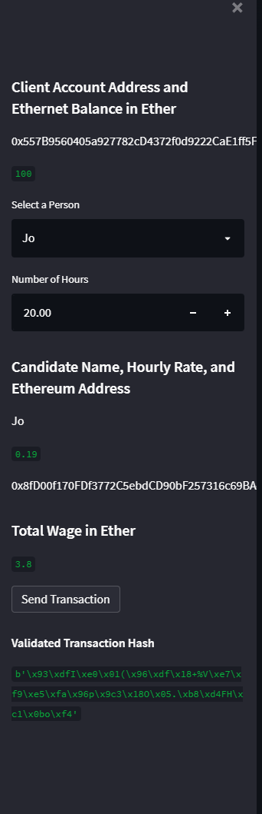
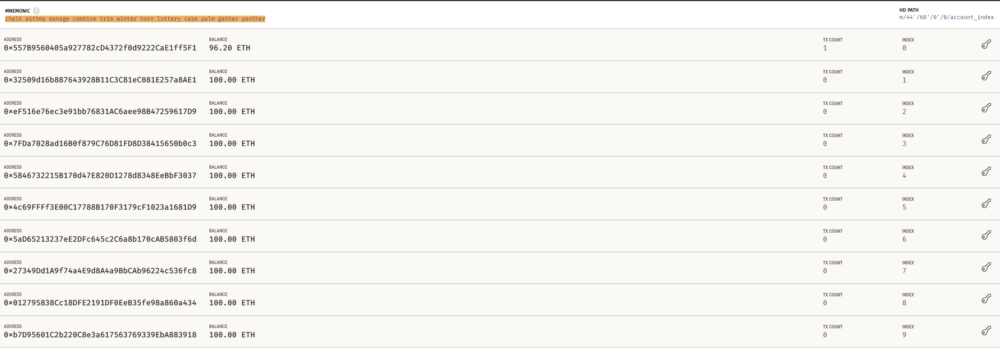
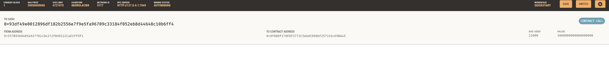
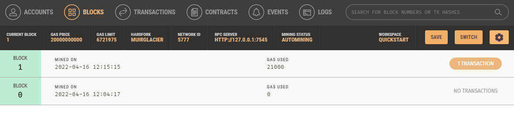
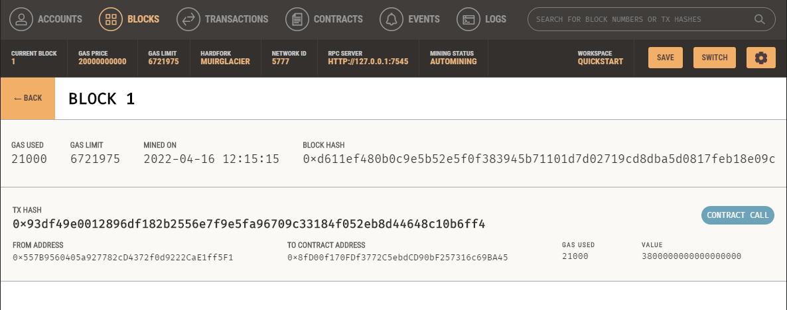

# Blockchain_wallet

## Streamlit Transaction
### In my Streamlit application, I decided to go with Jo working a total of 20 hours. You can see the transaction and the transaction hash.

 

## Ganache balance
### You can see in Ganache that the transaction hit my account because my balance went from 100 to 96.2 ETH

 

## Ganache Transaction

 

## Ganache blocks

 

## Ganache Recipient

 